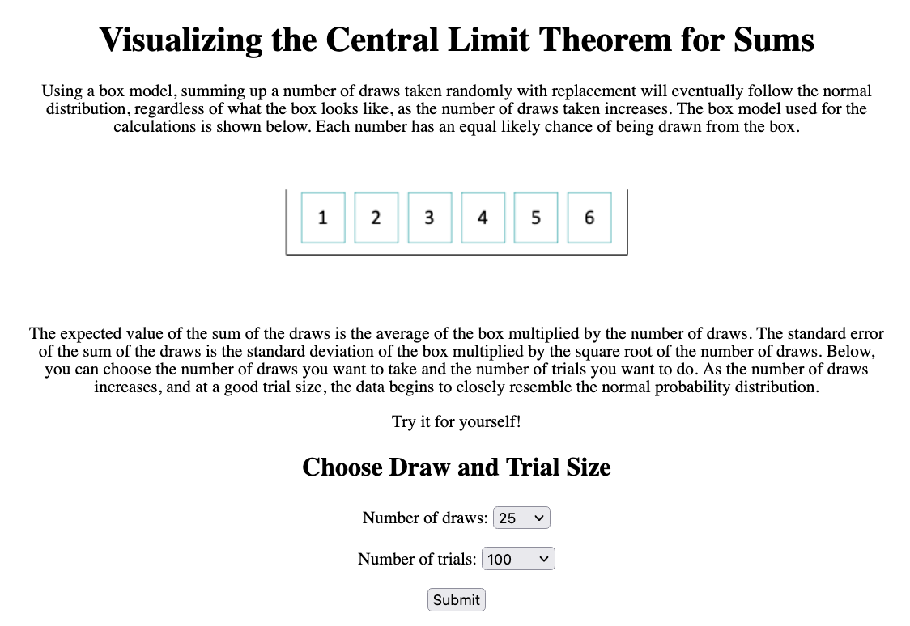
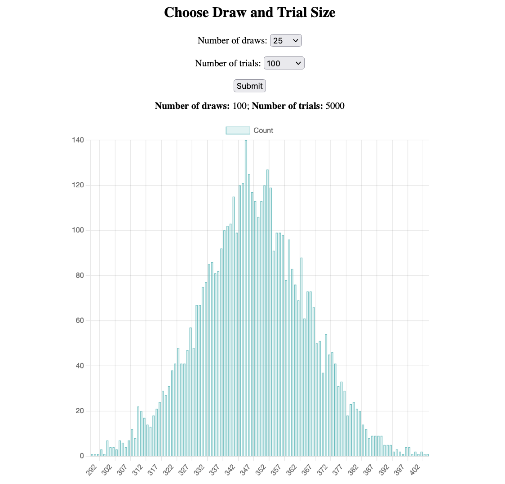

# Visualizing the Central Limit Theorem for Sums

I am interested in making concepts in statistics and probability easier to understand through visualizations and simulations (since this is what helps me understand topics better), so I decided to create a web app that would help demonstrate the central limit theorem. 

This is a website made using flask that helps to visualize the central limit theorem when applied to sums. Using the box model, summing up a number of draws taken randomly with replacement from a box with specified "tickets" will eventually follow the normal distribution regardless of the contents of the box as the number of draws taken increases.

The expected value of the sum of the draws is the average of the box multiplied by the number of draws.
The standard error of the sum of the draws is the standard deviation of the box multiplied by the square root of the number of draws. This can be seen for larger numbers of draws.

This flask app allows you to choose the number of draws you want to take and the number of trials you want to do. As the number of draws increases, and at a good trial size, the data begins to closely resemble the normal probability distribution.

The visualization was created using Chart.js.

To run the app:
- Clone the repository in your chosen directory
- In chosen directory, run pip install -r requirements.txt
- You should now be in a directory with the folder "clt" in it. In your terminal type
```
export FLASK_APP=clt
export FLASK_ENV=development
flask run
```
The app should now be up and running!


Below you can view two screenshots of the webpage, one for the introductory text and form submission and one for the graph that is generated. This occurs on one webpage.
 
 